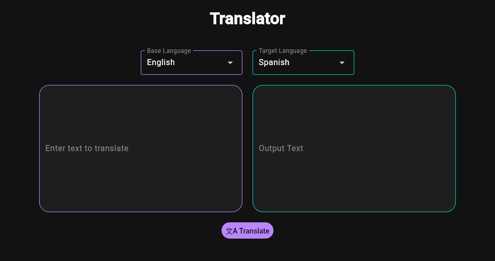

# Language Translator

-Translates desired text between a few languages using Google APIs

-Needs internet

-Minimalistic simple gui built with flet so you can run on mobile desktop or in the web!

### Installation


## Requirements
- Python 3.10 +
- Flet
- Deep Translator
- Linux / Macos / Windows

## Linux / macOS Instalation
```bash
git clone https://github.com/benpyles/Language-Translator
cd Language-Translator
python3 -m venv .venv
source .venv/bin/activate
pip install -r requirements.txt
```

## Windows Cmd
```bash
git clone https://github.com/benpyles/Language-Translator
cd Language-Translator
python -m venv .venv
.venv\Scripts\activate
pip install -r requirements.txt
```

## Windows Powershell
```bash
git clone https://github.com/benpyles/Language-Translator
cd Language-Translator
python -m venv .venv
.venv\Scripts\Activate.ps1
pip install -r requirements.txt
```

## Usage Linux / Macos
```bash
python3 gui.py
```

## Usage Windows Cmd / Powershell
```bash
python gui.py
```

##Screenshots



##Project structure

- gui.py - stores ui and flet code main file
- send_request.py - handles the translating and communicates with google servers
- hover_animations.py - still in development but is going to be animations

### Status

## What to do
    - hover animations
    - Different ui themes
    - Add support for different languages
    - Improve code structure

## How to contribute

- Fork the repository
- Create a new branch
- Make you Additions
- Commit the changes
- Push the changes
- Open a Pull Request

### License

This project is licensed under the MIT License. See the [LICENSE](LICENSE) file for details.